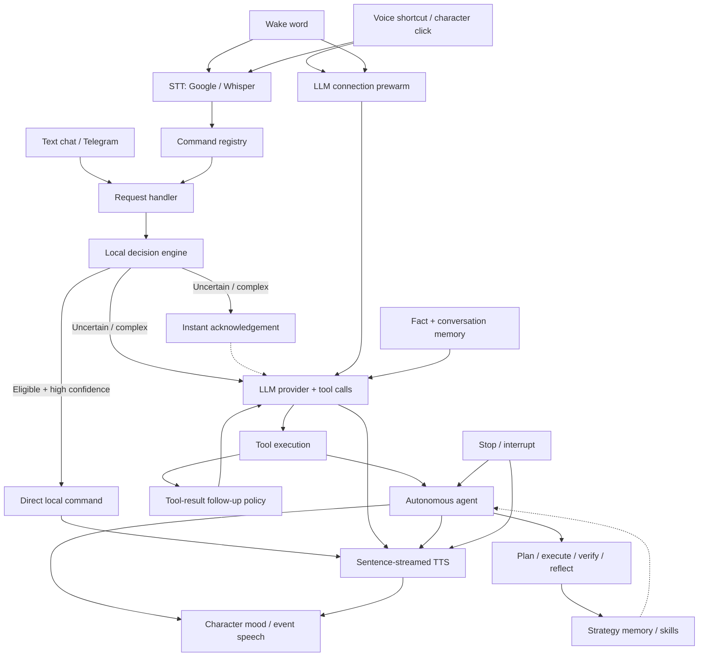

# 🎙️ Ari — Open-Source Windows AI Voice Assistant & Desktop Automation Agent

<div align="center">
  
  <p><strong>Voice control, desktop automation, local AI, memory, MCP tools, and an animated assistant — in one Windows app.</strong></p>
  <p>
    <a href="https://github.com/DO0OG/Ari-VoiceCommand/releases/latest"></a>
    <a href="https://github.com/DO0OG/Ari-VoiceCommand/stargazers"></a>
    
    
    
    
    
    
  </p>
  <p><strong>English</strong> · <a href="./README.ko.md">한국어</a> · <a href="./README.ja.md">日本語</a></p>
  <p>
    <a href="https://github.com/DO0OG/Ari-VoiceCommand/releases/latest"></a>
    <a href="https://ari-voice-command.vercel.app"></a>
    <a href="./docs/USAGE.md"></a>
  </p>
</div>

---

Ari is an **open-source Windows AI voice assistant and autonomous desktop agent** built with Python and PySide6. It combines wake-word voice control, speech-to-text (STT), text-to-speech (TTS), Windows automation, persistent memory, local or hosted LLMs, Model Context Protocol (MCP), plugins, and skills in one desktop application.

It is designed for people who want a Windows voice assistant that can do more than chat: Ari can route supported commands locally, hand complex goals to an agent workflow, use tools, verify results, remember useful context, and speak the result back.

> [!NOTE]
> Ari currently targets **Windows 10/11 (64-bit)**. Optional direct local execution, Telegram remote commands, and remote embeddings are disabled by default.

## What Ari can do

| Area | Capabilities |
| :--- | :--- |
| **Voice assistant** | Wake word, voice shortcut, character click, Google STT, offline Whisper STT, streamed speech output |
| **Windows automation** | Supported local commands plus multi-step desktop tasks through tools and the autonomous agent |
| **Fast local commands** | Optional high-confidence path for commands such as time, running apps, screenshots, and volume control |
| **Local AI** | Ollama local LLMs, local CosyVoice3, lightweight GPT-SoVITS TTS, local ONNX embeddings, and offline Whisper options |
| **Hosted AI** | OpenAI-compatible providers for models hosted locally or remotely |
| **Memory** | Relevant fact and conversation retrieval, explicit remember/forget commands, reviewable memory suggestions |
| **Agent workflows** | Plan, execute, verify, reflect, reuse strategies, interrupt active work, and resume supported flows |
| **Extensions** | Plugins, installable `SKILL.md` skills, MCP servers and tools |
| **Remote control** | Optional allow-listed Telegram commands through the same request pipeline |
| **Languages** | Korean, English, and Japanese UI/command routing |

## Why Ari

- **Windows-first, not browser-first.** Ari is built around desktop interaction, voice control, system commands, and Windows automation.
- **Local-first options.** Use Ollama, Whisper, CosyVoice3, and local embeddings when you want more of the stack to stay on-device.
- **Fast when a full model is unnecessary.** Supported high-confidence commands can use the optional local decision path instead of waiting on an LLM.
- **More than a chatbot.** Complex requests can enter a plan → execute → verify → reflect loop and use tools or reusable strategies.
- **A visible assistant.** The desktop character reflects activity and mood, supports event-based speech, and can be clicked to start talking.
- **Built to extend.** Add plugins, `SKILL.md` packages, MCP tools, or OpenAI-compatible model providers without replacing the core app.

## Example interactions

Ari's exact behavior depends on enabled features and your selected model/provider, but supported requests include things like:

```text
"What's the current time?"
"Set the volume to 30%."
"Take a screenshot."
"What apps are running?"
"Remember that I prefer concise answers."
"Forget what I told you about that preference."
```

For larger goals, Ari can pass the request into its autonomous agent workflow and use the tools available in your configuration.

## Quick start

### Requirements

- Windows 10/11 (64-bit)
- Python 3.11 for source installs
- 8 GB RAM recommended
- 4 GB GPU VRAM recommended when using local GPU-backed models

### Install the Windows build

Download `Ari-Setup-<version>.exe` from **[GitHub Releases](https://github.com/DO0OG/Ari-VoiceCommand/releases/latest)**.

The installer uses `Program Files\Ari` by default. User settings, history, and runtime data are stored under `%AppData%\Ari`.

### Run from source

```bat
git clone https://github.com/DO0OG/Ari-VoiceCommand.git
cd Ari-VoiceCommand\VoiceCommand
setup.bat
Ari.vbs
```

For local CosyVoice3, run `setup.bat --with-tts`. Use `Ari.bat` when you need startup diagnostics. See the **[Usage Guide](./docs/USAGE.md)** for configuration, providers, voice settings, skills, and advanced features.

## Local-first and privacy-aware defaults

Ari can use cloud services, but the project also supports a more local setup:

- Ollama for local LLM inference
- Offline Whisper for speech recognition
- CosyVoice3 for local TTS
- GPT-SoVITS (ONNX, no torch) for lightweight local TTS with voice cloning
- Local ONNX embeddings for memory and strategy retrieval
- Remote embeddings disabled by default
- Telegram integration disabled by default
- Direct local command execution disabled by default
- Plugins are not automatically loaded without user consent

The exact data flow depends on the providers and optional integrations you enable.

## How it works



## Verified local-decision evaluation

The optional local decision engine has a separate held-out evaluation for its supported command path:

- **7,407** generated evaluation examples
- **367** parser-confirmed direct selections
- **100.0% measured precision** for those selections
- **0 false direct selections** in that evaluation
- Warm inference: **p50 0.053 ms**, **p95 0.100 ms** over 1,000 iterations on an AMD64 Windows desktop

These numbers evaluate the decision/parser path only. They do **not** measure microphone recognition accuracy, overall agent success rate, or every possible user request.

## What's new in v1.1

- Faster voice interaction with wake-time connection prewarming and instant acknowledgement
- Wake word + command in one utterance
- Faster end-of-speech handling and improved Whisper behavior
- Streaming Edge TTS with caching and sentence-level playback
- Interrupt Ari while it is speaking or generating a response
- Explicit remember/forget commands and improved multilingual memory retrieval
- Persistent mood, conversational context, and event-based character speech
- Update checks, notifications, and installer reliability improvements
- v1.2.0: voice cloning and emotional speech across TTS providers — new OpenAI-compatible TTS, a lightweight local GPT-SoVITS TTS (Korean/English/Japanese, runs on CPU), ElevenLabs voice cloning and v3 emotion tags, and OpenAI custom voices
- v1.2.0: fixes the installed app closing right after startup, and every release installer is now launched and checked before publishing

See the **[v1.2.0 release notes](https://github.com/DO0OG/Ari-VoiceCommand/releases/tag/v1.2.0)**.

## For developers

Ari is a Python/PySide6 Windows desktop project with multiple extension points:

- **[Plugin development](./docs/PLUGIN_GUIDE.md)**
- **[MCP server and tools](./docs/MCP_SERVER.md)**
- **[Advanced agent guide](./docs/AGENT_ADVANCED.md)**
- **[Local decision engine](./docs/LOCAL_DECISION_ENGINE.md)**
- **[Theme customization](./docs/THEME_CUSTOMIZATION.md)**
- **[Credential handling](./docs/CREDENTIALS.md)**
- **[Contributing](./docs/CONTRIBUTING.md)**

Useful areas for contributions include Windows automation, STT/TTS, local model integrations, PySide6 UX, plugins, skills, MCP workflows, reliability, and multilingual support.

## Assets & credits

- Default character illustrations by **JAraTang**: <https://www.pixiv.net/users/78194943>
- `DNFBitBitv2` font, official source: <https://df.nexon.com/data/font/dnfbitbitv2>

Check the font's usage terms before redistributing or reusing it outside this project.

## License

Copyright © 2026 [DO0OG (MAD_DOGGO)](https://github.com/DO0OG).

Ari is released under the **MIT License**.
