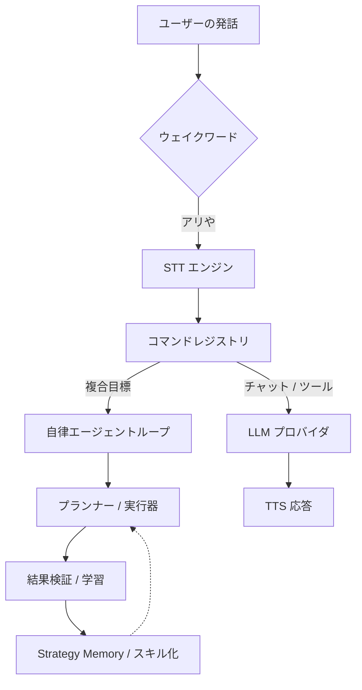

# 🎙️ Ari (アリ) — オープンソース Windows AI 音声アシスタント

<div align="center">
  
  <p align="center">
    <strong>ウェイクワード、多言語 STT/TTS、デスクトップ自動化、MCP ツール、プラグイン、ローカル LLM をサポートする Windows 向け音声アシスタント兼デスクトップエージェントです。</strong><br />
    Windows デスクトップで話しかけるだけで、Ari が内容を汲み取って処理を実行し、結果まで確かめます。使うほど手になじむ、オープンソースの Python/PySide6 製 AI アシスタントです。
  </p>

  <p align="center">
    
    
    
    
    
    
    
    
  </p>

  <p align="center">
    <a href="https://app.codacy.com/gh/DO0OG/Ari-VoiceCommand/dashboard">
      
    </a>
  </p>

  <p align="center">
    <a href="./README.ko.md">한국어</a> | <a href="./README.md">English</a> | <strong>日本語</strong>
  </p>
</div>

---

## 概要

- **Windows ネイティブの音声アシスタント** — ウェイクワードで呼び出し、声で指示し、声で返ってきます。
- **自律エージェントループ** — デスクトップ作業を計画してツールやコードを実行し、途中で失敗すれば自分で直して再試行します。
- **ローカル優先の AI スタック** — Ollama と CosyVoice3 を使い、なるべく外に出さない構成を選べます。
- **拡張しやすい構成** — プラグイン、`SKILL.md` スキル、MCP 連携に対応します。
- **PySide6 デスクトップ UI** — キャラクターウィジェット、チャット UI、視覚検証フローを備えています。

### クイックリンク

- [使用ガイド](./docs/USAGE.md)
- [Agent Skills / MCP](./docs/USAGE.md#4-에이전트-스킬-skills--mcp)
- [プラグイン開発](./docs/PLUGIN_GUIDE.md)
- [プロジェクトホームページ](https://ari-voice-command.vercel.app)
- [コントリビュート](./docs/CONTRIBUTING.md)

---

## クイックスタート

### 要件

- **OS:** Windows 10/11 (64-bit)
- **Python:** 3.11
- **Hardware:** RAM 8GB 以上推奨（ローカルモデル利用時は GPU VRAM 4GB 以上推奨）

### インストールと実行

```bat
git clone https://github.com/DO0OG/Ari-VoiceCommand.git
cd Ari-VoiceCommand
cd VoiceCommand
setup.bat
Ari.vbs
```

コマンドラインからインストールする場合は、`setup.bat` の代わりに
`py -3.11 install_dependencies.py` を実行してください。

通常の起動には、コンソールウィンドウを表示しない `Ari.vbs` を使用してください。
起動エラーを直接確認する必要がある場合のみ、診断用の `Ari.bat` を実行してください。
非表示での起動に失敗すると、`VoiceCommand/.ari_runtime/launcher_error.log` の末尾が
メッセージボックスに表示されます。

`setup.bat` をそのまま実行すると、メインアプリと一般的なオプション依存関係用の `.venv` が作られます。
ローカルの CosyVoice3 まで用意する場合は、`setup.bat --with-tts` を実行してください。
このコマンドは、CosyVoice3 の CUDA 対応 torch と TTS パッケージを収める2つ目の環境
`.venv-tts` も併せて作成します。venv を2つに分けておくことで、TTS パッケージが
メインアプリの CPU torch を上書きせずに済みます。

---

## Ari とは？

Ari は **Windows AI 音声アシスタント**であり、**自律デスクトップエージェント**でもあります。依頼を聞き取り、どう進めるかを組み立て、実際に手を動かし、結果を確かめ、そこで得たものを次の作業に活かします。

### 主要機能

| 領域 | 内容 |
| :--- | :--- |
| **音声パイプライン** | ウェイクワード、多言語 STT、自然な TTS 応答に対応します。 |
| **エージェント / 自動化** | 複雑な目標を計画し、Python/Shell 自動化を実行し、失敗すれば自分で直して再試行します。 |
| **スキル / プラグイン / MCP** | `SKILL.md` パッケージ、プラグイン、ローカル・リモートの MCP ツールで機能を広げられます。 |
| **ローカル AI スタック** | Ollama とローカル TTS パイプラインを使い、プライバシーを重んじる環境にも合わせられます。 |
| **UI / 検証** | PySide6 UI、アニメーションキャラクター、テキストチャット、OCR ベースの結果検証を備えます。 |
| **記憶 / パーソナライズ** | ユーザーの好みや実行戦略を蓄えておき、繰り返しの作業で使い回します。 |
| **リモート操作** | 許可された Telegram チャットから、ローカル UI と同じコマンド処理フローで Ari を動かせます。 |

### キャラクターウィジェットの主な拡張

- **夜間の眠気モード:** 夜の時間帯はアニメーション速度が落ち、あくびをしたり眠そうな反応を見せたりします。
- **プラグイン拡張性:** トレイメニュー、オーバーレイ、音声コマンド、キャラクター反応はマーケットプレイス配布のプラグインで足せます。

---

## 開発者向けハイライト

- **Python + PySide6 デスクトップアプリ:** 構造を追うのも、手を入れるのも、Windows 向けに固めるのも負担が少ない構成です。
- **自動化中心設計:** ブラウザ DOM 制御、ファイル・システム操作、エージェント駆動ワークフローを扱えます。
- **広い連携口:** OpenAI 互換プロバイダ、Ollama、MCP サーバー、プラグイン、インストール型スキルを幅広くつなげられます。
- **学習するランタイム:** Strategy Memory、同一実行内の失敗反省リトライ、埋め込みベースのスキル照合、スキルコンパイルが噛み合い、繰り返すほど結果が良くなります。

### 最近の更新

- **Telegram リモートコマンドブリッジ:** 許可リストによる chat_id 認証、long-polling、メッセージ編集を使ったストリーミング、スクリーンショット写真の送信に対応します（`telegram_enabled`、デフォルト無効）。
- **生成画像ダウンロードの制限:** 画像生成ツールは HTTPS URL からしか画像を取得しなくなりました。
- **自律エージェントの高度な機能:** ローカル MCP サーバー（ファイル読み書きツールを含む）、ストリーミング・ビジョン・ファイル/アプリツール、中断と再開、監査ログ、エージェントダッシュボードを追加しました。
- **多言語コマンドルーティング:** LLMRouter・WeatherCommand・ツールハンドラが韓国語・英語・日本語のキーワードを聞き分けるので、どの言語設定でもエージェントがきちんと起動します。
- **応答キャッシュの外部設定化:** LLM 応答キャッシュの TTL と最大サイズを `ari_settings.json` で調整できます（`agent_response_cache_ttl`、`agent_response_cache_max_size`）。
- **非同期エージェント作業キュー:** `AgentTaskQueue` がバックグラウンドタスクを優先度順に捌き、タスク単位でキャンセルできます。
- **エージェント結果メッセージの i18n 完成:** 実行ステータス・エージェント要約・レポート場所の文字列が韓国語・英語・日本語すべてで正しく訳されます。
- **safety_checker の細分化:** `curl`/`wget` が DANGEROUS から CAUTION に下がり、エージェントが読み取り専用の HTTP リクエストを送れるようになりました。データを送り出すフラグは DANGEROUS のままです。
- **フォールバックアシスタントの i18n:** `SimpleAIAssistant` の応答もランタイム翻訳を通るため、Groq の初期化に失敗しても言語がずれません。
- **CommandResult の伝播:** `WeatherCommand` などが `CommandResult` を返すようになり、成否の情報がプラグインイベントへ正確に届きます。
- **同一実行内の即時復旧:** 実行が失敗したときは、reflection lesson を同じ orchestration セッション内の 1 回限りの再試行コンテキストへそのまま渡せます。
- **バックグラウンド reflection 経路:** 実行が成功した場合は reflection を非同期で予約し、ユーザーが待っている完了応答を足止めしません。
- **計画反復回数の動的化:** 回数を固定せず、目標の難しさを見積もって再計画の上限回数を調整します。
- **lift ベースの有効化ゲート:** 学習指標で効果がマイナスに転じたコンポーネントは、しばらく止めておけます。
- **i18n 保守の一貫性:** 新しく追加した文字列は韓国語・英語・日本語の locale へまとめて反映します。

---

## システムアーキテクチャ

すべてはウェイクワードから始まります。要求はコマンド層とエージェント層を通り、ツール呼び出しまたは LLM ワークフローとして実行され、最後に結果を検証して学習へ戻されます。



---

## 性能と学習

Ari は使うほど良くなるように作ってあります。

| タスクカテゴリ | 初期成功率 | 学習後成功率 |
| :--- | :---: | :---: |
| **ファイル / システム制御** | 85% | **98%** |
| **ウェブ閲覧 / 検索** | 65% | **88%** |
| **複合ワークフロー** | 40% | **75%** |

- **Step 1 (0-50回):** いろいろ試しながら `StrategyMemory` を貯める段階
- **Step 2 (50-200回):** 最適化とスキルコンパイルが効いてくる段階
- **Step 3 (200回以上):** LLM への依存を抑え、定型作業を手早く片づける段階

---

## ドキュメント

- **[使用ガイド](./docs/USAGE.md)**: セットアップ、操作、設定
- **[Agent Skills / MCP](./docs/USAGE.md#4-에이전트-스킬-skills--mcp)**: スキル導入、管理 UI、MCP フロー
- **[プラグイン開発](./docs/PLUGIN_GUIDE.md)**: 独自機能の追加
- **[テーマカスタマイズ](./docs/THEME_CUSTOMIZATION.md)**: UI と見た目の変更

---

## コントリビュート

Windows 自動化、STT/TTS 連携、ローカルモデル対応、PySide6 UX、プラグイン基盤、MCP ワークフローまわりの貢献をとくに歓迎します。

詳しくは [コントリビューションガイド](./docs/CONTRIBUTING.md) をご覧ください。

---

## アセットと出典

- `DNFBitBitv2` フォント — 公式配布元:
  <https://df.nexon.com/data/font/dnfbitbitv2>

本プロジェクトの外へ再配布したり使い回したりする場合は、そのフォントの利用条件も併せて確認してください。

---

## License

Copyright © 2026 [DO0OG (MAD_DOGGO)](https://github.com/DO0OG).
This project is licensed under the **MIT License**.
