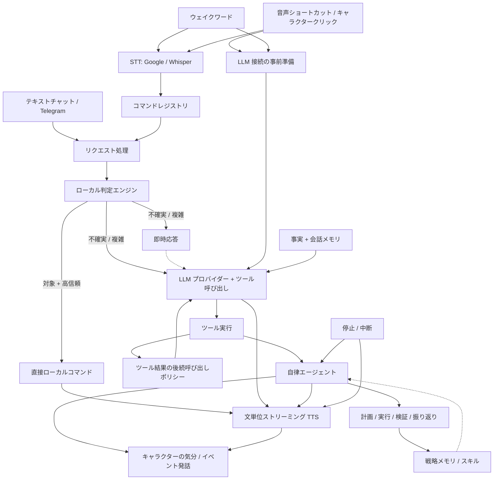

# 🎙️ Ari — オープンソース Windows AI 音声アシスタント・デスクトップ自動化エージェント

<div align="center">
  
  <p><strong>音声操作、デスクトップ自動化、ローカル AI、メモリ、MCP ツール、キャラクターアシスタントを一つの Windows アプリに。</strong></p>
  <p>
    <a href="https://github.com/DO0OG/Ari-VoiceCommand/releases/latest"></a>
    <a href="https://github.com/DO0OG/Ari-VoiceCommand/stargazers"></a>
    
    
    
    
    
    
  </p>
  <p><a href="./README.md">English</a> · <a href="./README.ko.md">한국어</a> · <strong>日本語</strong></p>
  <p>
    <a href="https://github.com/DO0OG/Ari-VoiceCommand/releases/latest"></a>
    <a href="https://ari-voice-command.vercel.app"></a>
    <a href="./docs/USAGE.md"></a>
  </p>
</div>

---

Ari は Python と PySide6 で作られた **オープンソースの Windows AI 音声アシスタント兼自律デスクトップエージェント**です。ウェイクワードによる音声操作、音声認識（STT）、音声合成（TTS）、Windows 自動化、永続メモリ、ローカル／ホスト型 LLM、Model Context Protocol（MCP）、プラグイン、スキルを一つのデスクトップアプリに統合します。

単に会話するだけではなく、対応コマンドをローカルで素早く判定し、複雑な目標をエージェントワークフローへ渡してツールを使い、結果を確認し、必要な情報を記憶して音声で返す Windows 向けアシスタントを目指しています。

> [!NOTE]
> 現在 Ari は **Windows 10/11 64-bit** 向けです。Telegram リモートコマンドとリモート埋め込みは既定で無効です。

## Ari でできること

| 分野 | 機能 |
| :--- | :--- |
| **音声アシスタント** | ウェイクワード、音声ショートカット、キャラクタークリック、Google STT、オフライン Whisper STT、ストリーミング音声出力 |
| **Windows 自動化** | 対応するローカルコマンドと、ツール・自律エージェントによる複数手順のデスクトップ作業 |
| **高速ローカルコマンド** | 高信頼の対応コマンドで既定で使われ、設定 → エージェントで無効にできるルート |
| **ローカル AI** | Ollama ローカル LLM、ローカル CosyVoice3、ローカル ONNX 埋め込み、オフライン Whisper |
| **ホスト型 AI** | ローカルまたはリモートで動く OpenAI 互換モデルプロバイダー |
| **メモリ** | 関連する事実・会話の検索、明示的な記憶／忘却、確認可能なメモリ候補 |
| **エージェント処理** | 計画、実行、検証、振り返り、戦略の再利用、実行中の処理停止、対応フローの再開 |
| **拡張** | プラグイン、インストール可能な `SKILL.md` スキル、MCP サーバー／ツール |
| **リモート操作** | 許可リスト方式の Telegram コマンドを同じリクエスト処理系へ接続 |
| **多言語** | 韓国語、英語、日本語の UI とコマンドルーティング |

## Ari の特徴

- **Windows を中心に設計:** ブラウザ中心のチャットではなく、デスクトップ操作、音声制御、システムコマンド、Windows 自動化を重視しています。
- **ローカル優先の構成が可能:** Ollama、Whisper、CosyVoice3、ローカル埋め込みを組み合わせ、より多くの処理を PC 内で行えます。
- **LLM が不要な処理は高速化:** 対応する高信頼コマンドは、ローカル判定ルートで LLM の応答を待たずに処理できます。
- **チャット以上の処理:** 複雑な依頼は「計画 → 実行 → 検証 → 振り返り」の流れに入り、ツールや再利用可能な戦略を利用できます。
- **見えるアシスタント:** デスクトップキャラクターが状態や気分を表現し、イベントに応じて発話し、クリックからすぐ音声入力を開始できます。
- **拡張しやすい構造:** コアを置き換えずに、プラグイン、`SKILL.md`、MCP ツール、OpenAI 互換プロバイダーを追加できます。

## 操作例

実際の動作は有効にした機能や選択したモデル／プロバイダーによって変わりますが、対応する依頼には次のようなものがあります。

```text
"今何時？"
"音量を30%にして。"
"スクリーンショットを撮って。"
"起動中のアプリを教えて。"
"短い回答が好きだと覚えて。"
"さっき伝えたその好みは忘れて。"
```

より大きな目標は自律エージェントのワークフローへ渡し、現在の設定で利用できるツールを使って処理できます。

## クイックスタート

### 要件

- Windows 10/11 (64-bit)
- ソースから実行する場合は Python 3.11
- RAM 8 GB 推奨
- GPU を使うローカルモデルでは VRAM 4 GB 推奨

### Windows 版をインストール

**[GitHub Releases](https://github.com/DO0OG/Ari-VoiceCommand/releases/latest)** から `Ari-Setup-<version>.exe` をダウンロードして実行してください。

既定のインストール先は `Program Files\Ari` で、ユーザー設定・履歴・ランタイムデータは `%AppData%\Ari` に保存されます。

### ソースから実行

```bat
git clone https://github.com/DO0OG/Ari-VoiceCommand.git
cd Ari-VoiceCommand\VoiceCommand
setup.bat
Ari.vbs
```

ローカル CosyVoice3 も準備する場合は `setup.bat --with-tts` を実行してください。起動診断が必要な場合は `Ari.bat` を使用できます。プロバイダー、音声設定、スキル、高度な機能は **[使い方ガイド](./docs/USAGE.md)** を参照してください。

## ローカル優先構成とプライバシーを意識した既定値

Ari はクラウドサービスも利用できますが、より多くの処理をローカルに置く構成にも対応します。

- Ollama によるローカル LLM
- オフライン Whisper 音声認識
- CosyVoice3 ローカル TTS
- メモリ／戦略検索向けローカル ONNX 埋め込み
- リモート埋め込みは既定で無効
- Telegram 連携は既定で無効
- ローカル直接処理は許可リスト内の高信頼コマンドに限られ、設定 → エージェントで無効にできます
- ユーザーの同意なしにプラグインを自動読み込みしない（承認したプラグインは隔離されず、アプリの権限で実行）

実際のデータフローは、有効にしたプロバイダーとオプション機能によって異なります。

## 動作の流れ


```mermaid
graph TD
    Wake["ウェイクワード"] --> STT["STT: Google / Whisper"]
    Manual["音声ショートカット / キャラクタークリック"] --> STT
    Manual --> Warm
    Wake --> Warm["LLM 接続の事前準備"]
    STT --> Registry["コマンドレジストリ"]
    Chat["テキストチャット / Telegram"] --> Handler["リクエスト処理"]
    Registry --> Handler
    Handler --> Decision["ローカル判定エンジン"]
    Decision -- "対象 + 高信頼" --> Fast["直接ローカルコマンド"]
    Decision -- "不確実 / 複雑" --> Ack["即時応答"]
    Decision -- "不確実 / 複雑" --> LLM["LLM プロバイダー + ツール呼び出し"]
    Ack -.-> LLM
    Warm --> LLM
    LLM --> Tools["ツール実行"]
    Tools --> Policy["ツール結果の後続呼び出しポリシー"]
    Policy --> LLM
    Memory["事実 + 会話メモリ"] --> LLM
    Tools --> Agent["自律エージェント"]
    Agent --> Loop["計画 / 実行 / 検証 / 振り返り"]
    Loop --> Strategy["戦略メモリ / スキル"]
    Strategy -.-> Agent
    Fast --> TTS["文単位ストリーミング TTS"]
    LLM --> TTS
    Agent --> TTS
    Agent --> Character["キャラクターの気分 / イベント発話"]
    TTS --> Character
    Stop["停止 / 中断"] --> TTS
    Stop --> Agent
```

## 検証済みローカル判定評価

ローカル判定エンジンには、対応コマンド経路向けの独立したホールドアウト評価があります。

- 生成評価例 **7,407件**
- パーサー確認済み直接選択 **367件**
- その選択に対する **測定精度 100.0%**
- この評価での **誤った直接選択 0件**
- AMD64 Windows デスクトップで 1,000 回のウォーム推論: **p50 0.053ms**、**p95 0.100ms**

これらの数値は判定／パーサー経路のみを評価したものです。マイク音声認識の精度、エージェント全体の成功率、あらゆるユーザー依頼の成功率を示すものではありません。

## v1.1 の主な変更点

- ウェイク時の接続事前準備と即時応答による、より速い音声インタラクション
- ウェイクワードと命令を一度に発話
- 発話終了判定の高速化と Whisper 動作改善
- Edge TTS のストリーミング／キャッシュと文単位再生
- Ari の発話中や応答生成中に中断
- 明示的な記憶／忘却コマンドと多言語メモリ検索の改善
- 持続する気分、会話コンテキスト、イベントベースのキャラクター発話
- アップデート確認・通知とインストーラーの安定性向上
- v1.2.0: TTS 全体でボイスクローンと感情表現（OpenAI 互換 TTS、ElevenLabs のボイスクローンと v3 感情タグ、OpenAI カスタムボイス）、インストール版が起動直後に終了する問題を修正
- v1.2.1: Fish Audio・ElevenLabs の TTS が最初の音声断片から再生され、TTS 音量設定がすべてのエンジンに適用され、TTS 再生の失敗を吹き出しで通知
- v1.2.1: 吹き出しがキャラクターの頭のすぐ上に表示され、「ネイバーを開いて」のような依頼でアプリがなければ既知のサイトをブラウザで開き、不足していた翻訳を追加
- v1.2.2: マイクの自動感度調整を既定でオフ、高速ローカル処理を既定でオンにし、チャットのちらつき・幅拡大、Python ツールの WinError 6、停止後の CosyVoice 再読み込み、一時停止中の予約削除を修正
- v1.2.3: 設定ウィンドウを小さくしてもタブをスクロールでき、LLM プロバイダーの変更が再起動なしで反映され、CosyVoice のインストールが Python 3.10/3.11 を自動で検出
- v1.3.0: ネットワークツールが内部ネットワークのアドレスへアクセスできないようにし、Google アカウント連携を設定画面で完了できるようにし、ゲームモード・記憶の削除・ベータチャンネル・設定保存の安定性を改善

詳しくは **[v1.3.0 リリースノート](https://github.com/DO0OG/Ari-VoiceCommand/releases/tag/v1.3.0)** をご覧ください。

## 開発者向けドキュメント

Ari は複数の拡張ポイントを持つ Python/PySide6 製 Windows デスクトッププロジェクトです。

- **[プラグイン開発](./docs/PLUGIN_GUIDE.md)**
- **[MCP サーバーとツール](./docs/MCP_SERVER.md)**
- **[高度なエージェント機能](./docs/AGENT_ADVANCED.md)**
- **[ローカル判定エンジン](./docs/LOCAL_DECISION_ENGINE.md)**
- **[テーマのカスタマイズ](./docs/THEME_CUSTOMIZATION.md)**
- **[認証情報の管理](./docs/CREDENTIALS.md)**
- **[コントリビューションガイド](./docs/CONTRIBUTING.md)**

Windows 自動化、STT/TTS、ローカルモデル連携、PySide6 UX、プラグイン、スキル、MCP ワークフロー、安定性、多言語対応へのコントリビューションを歓迎します。

## アセットとクレジット

- デフォルトキャラクター画像 — **JAraTang**: <https://www.pixiv.net/users/78194943>
- `DNFBitBitv2` フォント — 公式配布元: <https://df.nexon.com/data/font/dnfbitbitv2>

プロジェクト外で再配布・再利用する場合は、フォントの利用条件も確認してください。

## ライセンス

Copyright © 2026 [DO0OG (MAD_DOGGO)](https://github.com/DO0OG).

Ari は **MIT License** で公開されています。
