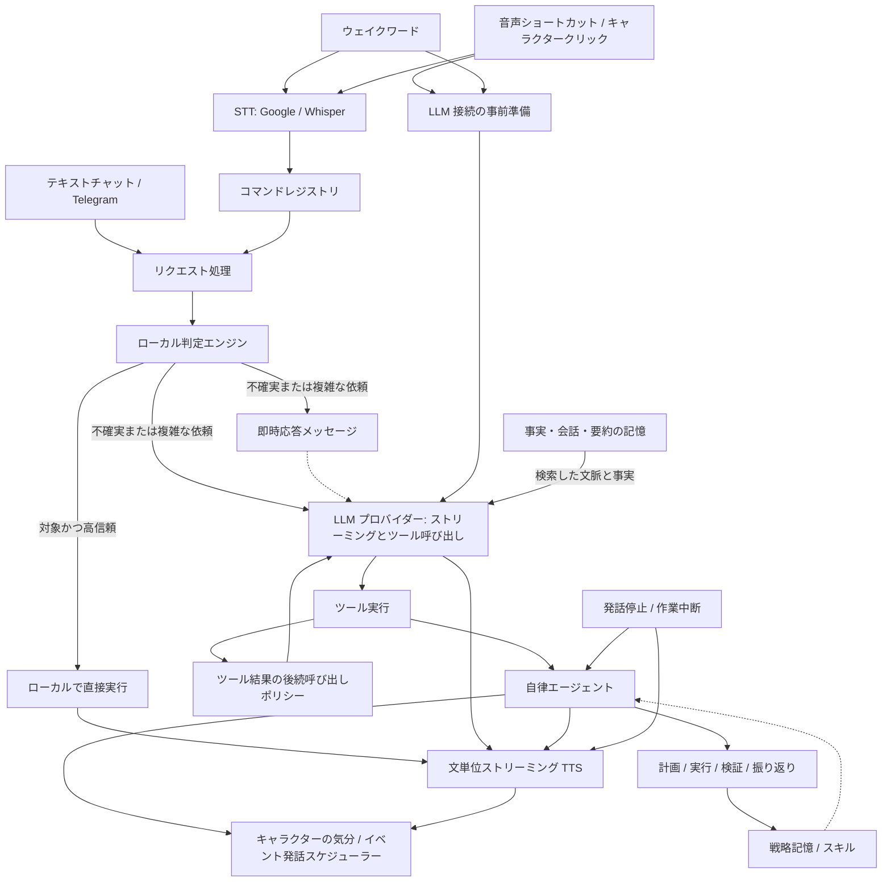

# 🎙️ Ari — オープンソースのWindows音声アシスタント・デスクトップエージェント

<div align="center">
  
  <p><strong>話す・入力する・クリックするだけでWindowsの作業を頼み、音声で結果を確認できます。</strong></p>
  <p>
    
    
    
    
    
    <a href="https://app.codacy.com/gh/DO0OG/Ari-VoiceCommand/dashboard"></a>
  </p>
  <p><a href="./README.md">English</a> | <a href="./README.ko.md">한국어</a> | <strong>日本語</strong></p>
  <p>
    <a href="https://github.com/DO0OG/Ari-VoiceCommand/releases"></a>
    <a href="https://ari-voice-command.vercel.app"></a>
    <a href="./docs/USAGE.md"></a>
  </p>
</div>

---

## Ari の特長

- **音声操作と作業実行を一つに:** ウェイクワード、音声ショートカット、キャラクターのクリックで依頼し、複数手順のデスクトップ作業を任せられます。
- **すばやいローカル判定:** 対応する高信頼のコマンドは LLM を使わず実行でき、不確かな依頼は設定したプロバイダーに進みます。直接実行は既定で無効です。
- **反応するキャラクター:** ウィジェットが活動や気分を表現し、戻ってきたときや作業完了時などにイベントに応じて話します。
- **ローカルモデルとホスト型モデル:** Ollama、ローカルの CosyVoice3 と ONNX 埋め込み、OpenAI 互換 LLM プロバイダーを利用できます。リモート埋め込みは既定で無効です。
- **管理できる記憶:** 事実や会話履歴を検索し、記憶・忘却を指示できます。プロフィール情報の候補は確認してから保存できます。
- **拡張と多言語:** プラグイン、`SKILL.md` スキル、MCP ツールを追加できます。Telegram リモート操作は既定で無効で、日本語・英語・韓国語に対応します。

## 機能一覧

| 領域 | Ari の機能 |
| :--- | :--- |
| 音声入力 | ウェイクワード、音声ショートカット、キャラクタークリック、Google またはオフライン Whisper STT |
| テキスト・リモート入力 | テキストチャットと許可リスト登録済み Telegram コマンド (Telegram は既定で無効) |
| ローカル判定 | 高信頼コマンド向けの任意機能で、既定で無効です。LLM 会話経路にフォールバックします |
| 自律エージェント | 計画、ツール実行、結果検証、振り返り、再利用できる戦略の記録 |
| 記憶 | 事実や会話要約の取得、検索、記憶、忘却、候補の確認 |
| 音声とキャラクター | 文単位のストリーミング TTS、気分、イベント発話、停止操作 |
| モデルと拡張 | Ollama、CosyVoice3、ローカル ONNX 埋め込み、OpenAI 互換プロバイダー、プラグイン、スキル、MCP |

## クイックスタート

### 要件

- Windows 10/11 (64-bit)。
- ソースから実行する場合は Python 3.11 が必要です。
- RAM は 8 GB を推奨し、ローカルモデルには GPU VRAM 4 GB を推奨します。

### インストール

[Releases](https://github.com/DO0OG/Ari-VoiceCommand/releases)から`Ari-Setup-<version>.exe`をダウンロードして実行してください。既定のインストール先は`Program Files\Ari`で、設定と履歴は`%AppData%\Ari`に保存されます。

ソースから実行する場合は Python 3.11 を使用してください。

```bat
git clone https://github.com/DO0OG/Ari-VoiceCommand.git
cd Ari-VoiceCommand\VoiceCommand
setup.bat
Ari.vbs
```

ローカル CosyVoice3 は `setup.bat --with-tts` で準備できます。以前の zip 版のデータは、設定 → デバイス設定 →「以前のバージョンからデータをインポート」で `.ari_runtime` フォルダーを選んで取り込めます。診断用の `Ari.bat` と詳しい使い方は[ガイド](./docs/USAGE.md)をご覧ください。

## システムアーキテクチャ

ウェイクワードを検知すると接続の事前準備と音声認識を始めます。テキストと Telegram の依頼も同じ対話処理に進みます。


```mermaid
graph TD
    Wake["ウェイクワード"] --> STT["STT: Google / Whisper"]
    Manual["音声ショートカット / キャラクタークリック"] --> STT
    Manual --> Warm
    Wake --> Warm["LLM 接続の事前準備"]
    STT --> Registry["コマンドレジストリ"]
    Chat["テキストチャット / Telegram"] --> Handler["リクエスト処理"]
    Registry --> Handler
    Handler --> Decision["ローカル判定エンジン"]
    Decision -- "対象かつ高信頼" --> Fast["ローカルで直接実行"]
    Decision -- "不確実または複雑な依頼" --> Ack["即時応答メッセージ"]
    Decision -- "不確実または複雑な依頼" --> LLM["LLM プロバイダー: ストリーミングとツール呼び出し"]
    Ack -.-> LLM
    Warm --> LLM
    LLM --> Tools["ツール実行"]
    Tools --> Policy["ツール結果の後続呼び出しポリシー"]
    Policy --> LLM
    Memory["事実・会話・要約の記憶"] -- "検索した文脈と事実" --> LLM
    Tools --> Agent["自律エージェント"]
    Agent --> Loop["計画 / 実行 / 検証 / 振り返り"]
    Loop --> Strategy["戦略記憶 / スキル"]
    Strategy -.-> Agent
    Fast --> TTS["文単位ストリーミング TTS"]
    LLM --> TTS
    Agent --> TTS
    Agent --> Character["キャラクターの気分 / イベント発話スケジューラー"]
    TTS --> Character
    Stop["発話停止 / 作業中断"] --> TTS
    Stop --> Agent
```

- ローカル判定エンジンは、対応コマンドの解析と信頼度・実行ポリシーの条件を満たした場合だけ実行します。直接実行は既定で無効です。
- ツールの結果に応じてローカルで返答するか、LLM に後続応答を依頼します。複雑な作業は計画・実行・検証・振り返りの流れに進みます。
- 検索した事実や会話の文脈をプロバイダーのプロンプトに加えます。文単位の出力を TTS に送り、キャラクターは気分やイベントに応じて話します。停止操作で発話やエージェント作業を中断できます。

## 判定エンジンの数値

- 生成したテスト文 7,407 件のうち、パーサーが確認した 367 件の選択で測定精度は 100.0%、誤った直接実行は 0 件でした。この評価ではコマンド実行やマイク認識率を測定していません。
- AMD64 の Windows デスクトップで 1,000 回実行したウォーム推論の遅延は p50 0.053 ms、p95 0.100 ms でした。

## v1.1 の新機能

- 即時応答メッセージを用意し、ウェイクワード検知時に接続を事前準備します。
- イベントに応じてキャラクターが話し、記憶の候補を確認して管理できます。
- 応答をストリーミングし、文単位で音声を出力します。

[リリース一覧](https://github.com/DO0OG/Ari-VoiceCommand/releases)。

## ドキュメント

- [使い方ガイド](./docs/USAGE.md)
- [ローカル判定エンジン](./docs/LOCAL_DECISION_ENGINE.md)
- [自律エージェントの詳細](./docs/AGENT_ADVANCED.md)
- [プラグインガイド](./docs/PLUGIN_GUIDE.md) · [MCP サーバー](./docs/MCP_SERVER.md)
- [テーマのカスタマイズ](./docs/THEME_CUSTOMIZATION.md)
- [認証情報の管理](./docs/CREDENTIALS.md)

## コントリビュート

コントリビュートを歓迎します。まずは[コントリビューションガイド](./docs/CONTRIBUTING.md)をご覧ください。

## アセットとクレジット

- 既定のキャラクターイラスト — **JAraTang** 氏: <https://www.pixiv.net/users/78194943>
- `DNFBitBitv2` フォントの公式配布元: <https://df.nexon.com/data/font/dnfbitbitv2>

本プロジェクトの外へ再配布したり使い回したりする場合は、そのフォントの利用条件も併せて確認してください。

## License

Copyright © 2026 [DO0OG (MAD_DOGGO)](https://github.com/DO0OG).
This project is licensed under the **MIT License**.
