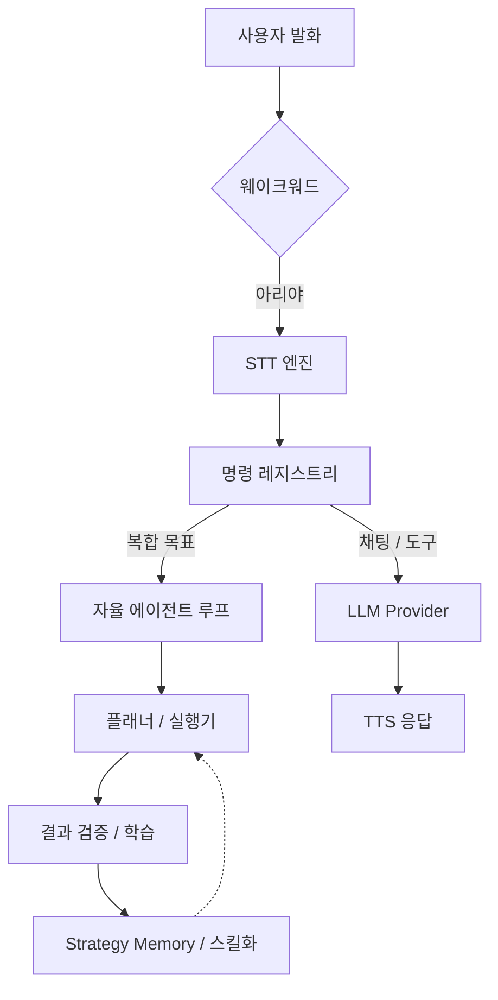

# 🎙️ Ari (아리) — 오픈소스 Windows AI 음성 어시스턴트

<div align="center">
  
  <p align="center">
    <strong>웨이크워드, 다국어 STT/TTS, 데스크톱 자동화, MCP 도구, 플러그인, 로컬 LLM을 지원하는 Windows용 음성 어시스턴트이자 데스크톱 에이전트입니다.</strong><br />
    Windows 데스크톱에서 음성으로 지시하면 아리가 알아듣고 작업을 처리한 뒤 결과까지 확인합니다. 쓸수록 손에 익는 오픈소스 Python/PySide6 기반 AI 어시스턴트입니다.
  </p>

  <p align="center">
    
    
    
    
    
    
    
    
  </p>

  <p align="center">
    <a href="https://app.codacy.com/gh/DO0OG/Ari-VoiceCommand/dashboard">
      
    </a>
  </p>

  <p align="center">
    <strong>한국어</strong> | <a href="./README.md">English</a> | <a href="./README.ja.md">日本語</a>
  </p>
</div>

---

## 한눈에 보기

- **Windows 네이티브 음성 어시스턴트** — 웨이크워드로 깨우고, 음성으로 지시하고, 음성으로 답을 받습니다.
- **자율 에이전트 루프** — 데스크톱 작업을 계획하고 도구나 코드를 실행하며, 중간에 실패하면 스스로 고쳐서 다시 시도합니다.
- **로컬 우선 AI 스택** — Ollama와 CosyVoice3를 써서 가급적 바깥으로 나가지 않는 구성을 택할 수 있습니다.
- **확장 여지** — 플러그인, `SKILL.md` 스킬, Model Context Protocol(MCP) 연동을 지원합니다.
- **PySide6 데스크톱 UI** — 캐릭터 위젯, 채팅 UI, 시각 검증 흐름을 제공합니다.

### 빠른 링크

- [사용 가이드](./docs/USAGE.md)
- [에이전트 스킬 / MCP](./docs/USAGE.md#4-에이전트-스킬-skills--mcp)
- [플러그인 개발](./docs/PLUGIN_GUIDE.md)
- [프로젝트 홈페이지](https://ari-voice-command.vercel.app)
- [기여 가이드](./docs/CONTRIBUTING.md)

---

## 빠른 시작

### 요구 사항

- **OS:** Windows 10/11 (64-bit)
- **Python:** 3.11
- **Hardware:** RAM 8GB 이상 권장 (로컬 모델 사용 시 GPU VRAM 4GB 이상 권장)

### 설치 및 실행

[Releases](https://github.com/DO0OG/Ari-VoiceCommand/releases)에서 `Ari-Setup-<버전>.exe`를 받아 실행하면 됩니다.
기본 설치 경로는 `Program Files\Ari`이고, 설치 중에 다른 폴더를 고를 수 있습니다.
설정과 기록은 `%AppData%\Ari`에 저장되므로 제거해도 남습니다.
예전 zip 배포판을 쓰셨다면 설정 → 장치 설정에서 "이전 버전 데이터 가져오기"를 누르고 예전 `.ari_runtime` 폴더(또는 그 폴더가 들어 있는 폴더)를 고르세요. 없는 파일만 복사하고 기존 파일은 덮어쓰지 않습니다. 가져온 뒤에는 아리를 다시 시작하세요.

소스에서 직접 실행하려면:

```bat
git clone https://github.com/DO0OG/Ari-VoiceCommand.git
cd Ari-VoiceCommand
cd VoiceCommand
setup.bat
Ari.vbs
```

명령줄에서 설치하려면 `setup.bat` 대신
`py -3.11 install_dependencies.py`를 실행해 주세요.

일반 실행에는 콘솔 창을 띄우지 않는 `Ari.vbs`를 사용해 주세요. 시작 오류를
직접 확인해야 할 때만 진단용 `Ari.bat`를 실행해 주세요. 숨김 실행이 실패하면
`VoiceCommand/.ari_runtime/launcher_error.log`의 마지막 부분이 메시지 상자에 표시됩니다.

`setup.bat`를 그냥 실행하면 메인 앱과 일반 선택 의존성용 `.venv`가 만들어집니다.
로컬 CosyVoice3까지 준비하려면 `setup.bat --with-tts`를 실행해 주세요. 이 명령은
CosyVoice3의 CUDA torch와 TTS 패키지를 담을 두 번째 환경 `.venv-tts`도 함께 만듭니다.
이렇게 venv를 둘로 나눠 두어야 TTS 패키지가 메인 앱의 CPU torch를 덮어쓰지 않습니다.

---

## Ari는 어떤 프로젝트인가요?

Ari는 **Windows AI 음성 어시스턴트**이자 **자율 데스크톱 에이전트**입니다. 요청을 듣고, 어떻게 처리할지 계획을 세우고, 실제로 실행한 뒤 결과를 확인하고, 거기서 배운 것을 다음 작업에 씁니다.

### 핵심 기능

| 영역 | 설명 |
| :--- | :--- |
| **음성 파이프라인** | 웨이크워드 활성화, 다국어 STT, 자연스러운 TTS 응답을 지원합니다. |
| **에이전트 / 자동화** | 복합 목표를 계획하고 Python/Shell 자동화를 실행하며, 실패하면 스스로 고쳐서 다시 시도합니다. |
| **스킬 / 플러그인 / MCP** | `SKILL.md` 패키지, 플러그인, 로컬·원격 MCP 도구로 기능을 넓힐 수 있습니다. |
| **로컬 AI 스택** | Ollama와 로컬 TTS 파이프라인을 써서 프라이버시가 중요한 환경에도 맞출 수 있습니다. |
| **UI / 검증** | PySide6 UI, 애니메이션 캐릭터, 텍스트 채팅, OCR 기반 결과 검증을 제공합니다. |
| **기억 / 개인화** | 사용자 취향과 실행 전략을 쌓아 두고 반복 작업에 다시 씁니다. |
| **원격 제어** | 허용된 Telegram 채팅에서 로컬 UI와 똑같은 명령 처리 흐름으로 Ari를 조작할 수 있습니다. |

### 캐릭터 위젯 주요 확장 기능

- **야간 졸음 모드:** 밤 시간대에는 애니메이션 속도가 느려지고 하품하거나 졸린 반응을 보입니다.
- **플러그인 확장 여지:** 트레이 메뉴, 오버레이, 음성 명령, 캐릭터 반응은 마켓플레이스 플러그인으로 덧붙일 수 있습니다.

---

## 개발자 관점 하이라이트

- **Python + PySide6 데스크톱 앱:** 구조를 훑어보고 고치고 패키징하기까지 부담이 적습니다.
- **자동화 중심 설계:** 브라우저 DOM 제어, 파일·시스템 작업, 에이전트 기반 워크플로 실행을 다룹니다.
- **넓은 연동 지점:** OpenAI 호환 제공자, Ollama, MCP 서버, 플러그인, 설치형 스킬을 두루 붙일 수 있습니다.
- **학습하는 런타임:** Strategy Memory, 동일 실행 내 실패 반성 재시도, 임베딩 기반 스킬 매칭, 스킬 컴파일이 맞물려 반복 작업일수록 결과가 좋아집니다.

### 최근 업데이트

- **Telegram 원격 명령 브리지:** 허용 목록 기반 chat_id 인증, long-polling, 메시지 편집을 이용한 스트리밍, 해당 요청에서 생성된 스크린샷·이미지 전송, 4096자 초과 응답의 분할 전달을 지원합니다 (`telegram_enabled` 설정, 기본 비활성화).
- **생성 이미지 다운로드 제한:** 이미지 생성 도구는 이제 HTTPS URL에서만 이미지를 받아 옵니다.
- **자율 에이전트 고급 기능:** 로컬 MCP 서버(파일 읽기·쓰기 도구 포함), 스트리밍·비전·파일/앱 도구, 중단과 재개, 감사 로그, 에이전트 대시보드를 추가했습니다.
- **다국어 명령 라우팅:** LLMRouter, WeatherCommand, 툴 핸들러가 한국어·영어·일본어 키워드를 모두 알아들어, 어떤 언어로 설정해도 에이전트가 제대로 깨어납니다.
- **응답 캐시 설정 외부화:** LLM 응답 캐시 TTL과 최대 크기를 `ari_settings.json`에서 조정할 수 있습니다 (`agent_response_cache_ttl`, `agent_response_cache_max_size`).
- **비동기 에이전트 작업 큐:** `AgentTaskQueue`가 백그라운드 작업을 우선순위대로 처리하고, 작업 하나씩 따로 취소할 수 있습니다.
- **에이전트 결과 메시지 i18n 완성:** 실행 상태, 에이전트 요약, 보고서 위치 문자열이 한국어·영어·일본어에서 모두 제대로 번역됩니다.
- **safety_checker 세분화:** `curl`/`wget`이 DANGEROUS에서 CAUTION으로 내려가 에이전트가 읽기 전용 HTTP 요청을 할 수 있습니다. 데이터를 밖으로 보내는 플래그는 그대로 DANGEROUS입니다.
- **폴백 어시스턴트 i18n:** `SimpleAIAssistant` 응답도 런타임 번역을 거치므로 Groq 초기화가 실패해도 언어가 어긋나지 않습니다.
- **CommandResult 전파:** `WeatherCommand` 등이 `CommandResult`를 반환하면서 성공·실패 정보가 플러그인 이벤트에 정확히 전달됩니다.
- **동일 실행 내 즉시 복구:** 실행이 실패하면 reflection lesson을 같은 orchestration 세션의 1회 재시도 컨텍스트로 바로 넘길 수 있습니다.
- **백그라운드 reflection 경로:** 실행이 성공하면 reflection을 비동기로 예약해, 사용자가 기다리는 완료 응답을 붙잡아 두지 않습니다.
- **계획 반복 횟수 동적화:** 루프 횟수를 고정하는 대신 목표 난이도를 가늠해 재계획 최대 횟수를 조절합니다.
- **lift 기반 활성화 제어:** 학습 지표에서 효과가 음수로 돌아선 컴포넌트는 잠시 꺼 둘 수 있습니다.
- **i18n 유지보수 일관성:** 새로 추가한 문자열은 한국어·영어·일본어 locale에 한꺼번에 반영합니다.

---

## 시스템 아키텍처

웨이크워드가 모든 흐름의 시작점입니다. 요청은 명령 계층과 에이전트 계층을 거쳐 도구 호출이나 LLM 워크플로로 실행되고, 마지막에 결과를 검증해 학습으로 되돌립니다.



---

## 성능과 학습

Ari는 쓰면 쓸수록 나아지도록 만들었습니다.

| 작업 범주 | 초기 성공률 | 학습 후 성공률 |
| :--- | :---: | :---: |
| **파일 / 시스템 제어** | 85% | **98%** |
| **웹 탐색 / 검색** | 65% | **88%** |
| **복합 워크플로** | 40% | **75%** |

- **Step 1 (0-50회):** 이것저것 시도해 보며 `StrategyMemory`를 쌓는 단계
- **Step 2 (50-200회):** 최적화와 스킬 컴파일이 붙는 단계
- **Step 3 (200회 이상):** LLM에 덜 기대면서 반복 작업을 빠르게 처리하는 단계

---

## 문서

- **[사용 가이드](./docs/USAGE.md)**: 설정, 사용법, 운영 방법
- **[에이전트 스킬 / MCP](./docs/USAGE.md#4-에이전트-스킬-skills--mcp)**: 스킬 설치, 관리 UI, MCP 흐름
- **[플러그인 개발](./docs/PLUGIN_GUIDE.md)**: 기능 확장 방법
- **[테마 커스터마이징](./docs/THEME_CUSTOMIZATION.md)**: UI와 외형 변경

---

## 기여

Windows 자동화, STT/TTS 연동, 로컬 모델 지원, PySide6 UX, 플러그인 도구화, MCP 워크플로 쪽 기여를 특히 환영합니다.

자세한 내용은 [기여 가이드](./docs/CONTRIBUTING.md)를 참고해 주세요.

---

## 에셋 및 출처

- 기본 캐릭터 이미지 — **JAraTang** 작가님:
  <https://www.pixiv.net/users/78194943>
- `DNFBitBitv2` 폰트 — 공식 출처:
  <https://df.nexon.com/data/font/dnfbitbitv2>

프로젝트 밖으로 재배포하거나 다시 쓸 때는 해당 폰트의 이용 조건도 같이 확인해 주세요.

---

## License

Copyright © 2026 [DO0OG (MAD_DOGGO)](https://github.com/DO0OG).
This project is licensed under the **MIT License**.
