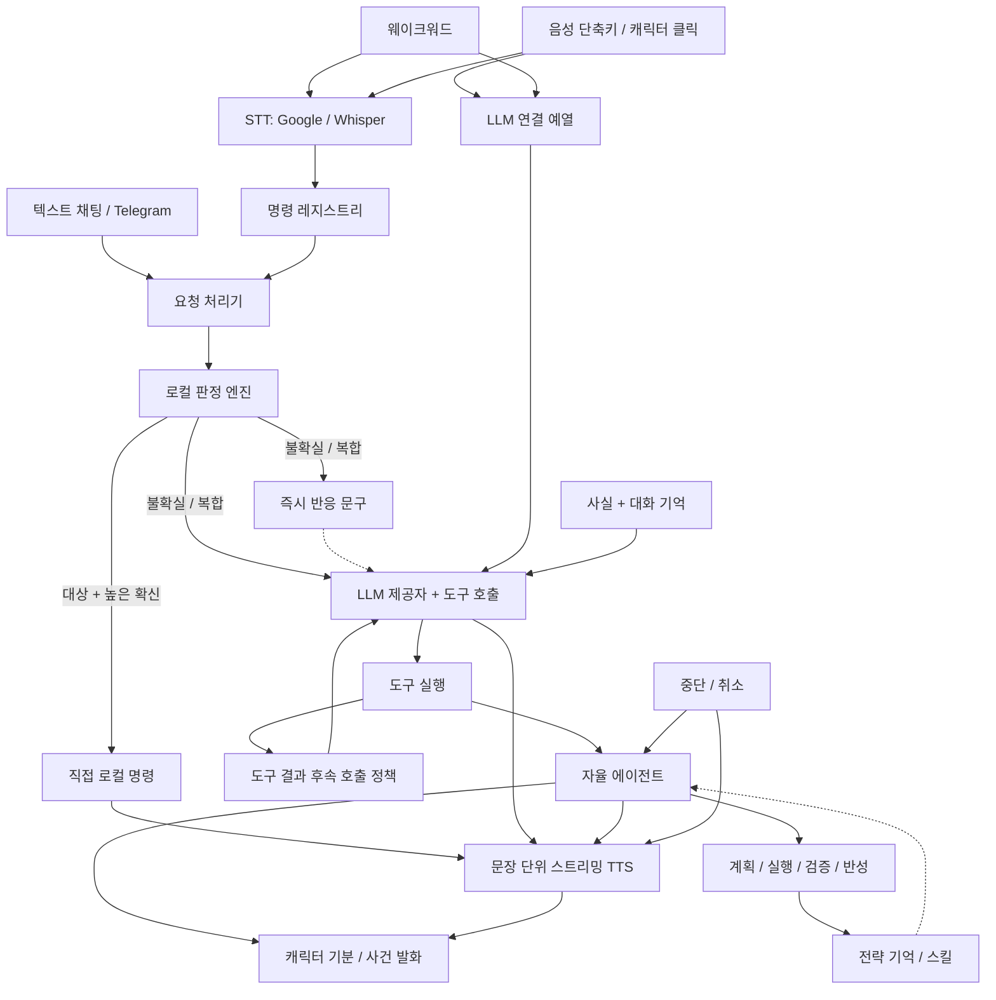

# 🎙️ Ari — 오픈소스 Windows AI 음성 비서 · 데스크톱 자동화 에이전트

<div align="center">
  
  <p><strong>음성 제어, 데스크톱 자동화, 로컬 AI, 기억, MCP 도구와 캐릭터 비서를 하나의 Windows 앱에서.</strong></p>
  <p>
    <a href="https://github.com/DO0OG/Ari-VoiceCommand/releases/latest"></a>
    <a href="https://github.com/DO0OG/Ari-VoiceCommand/stargazers"></a>
    
    
    
    
    
    
  </p>
  <p><a href="./README.md">English</a> · <strong>한국어</strong> · <a href="./README.ja.md">日本語</a></p>
  <p>
    <a href="https://github.com/DO0OG/Ari-VoiceCommand/releases/latest"></a>
    <a href="https://ari-voice-command.vercel.app"></a>
    <a href="./docs/USAGE.md"></a>
  </p>
</div>

---

Ari는 Python과 PySide6로 만든 **오픈소스 Windows AI 음성 비서이자 자율 데스크톱 에이전트**입니다. 웨이크워드 음성 제어, 음성 인식(STT), 음성 합성(TTS), Windows 자동화, 지속 기억, 로컬·호스팅 LLM, Model Context Protocol(MCP), 플러그인과 스킬을 하나의 데스크톱 앱에 결합합니다.

단순히 대화만 하는 음성 비서가 아니라, 지원되는 명령은 로컬에서 빠르게 판정하고 복잡한 목표는 에이전트 작업 흐름으로 넘겨 도구를 사용하고 결과를 확인하며, 필요한 맥락을 기억하고 음성으로 결과를 알려주는 Windows용 개인 비서를 목표로 합니다.

> [!NOTE]
> 현재 Ari는 **Windows 10/11 64-bit**를 대상으로 합니다. 선택형 직접 로컬 실행, Telegram 원격 명령, 원격 임베딩은 기본적으로 꺼져 있습니다.

## Ari로 할 수 있는 일

| 영역 | 기능 |
| :--- | :--- |
| **음성 비서** | 웨이크워드, 음성 단축키, 캐릭터 클릭, Google STT, 오프라인 Whisper STT, 스트리밍 음성 출력 |
| **Windows 자동화** | 지원 로컬 명령과 도구·자율 에이전트를 통한 여러 단계의 데스크톱 작업 |
| **빠른 로컬 명령** | 시간, 실행 중 앱, 스크린샷, 볼륨 제어 등 확신이 높은 지원 명령을 위한 선택형 경로 |
| **로컬 AI** | Ollama 로컬 LLM, 로컬 CosyVoice3, 가벼운 GPT-SoVITS TTS, 로컬 ONNX 임베딩, 오프라인 Whisper |
| **호스팅 AI** | 로컬 또는 원격 서버의 OpenAI 호환 모델 제공자 |
| **기억** | 관련 사실·대화 검색, 명시적 기억/잊기 명령, 검토 가능한 기억 후보 |
| **에이전트 작업** | 계획, 실행, 검증, 반성, 전략 재사용, 작업 중단과 지원되는 흐름 재개 |
| **확장 기능** | 플러그인, 설치형 `SKILL.md` 스킬, MCP 서버와 도구 |
| **원격 제어** | 허용 목록 기반 Telegram 명령을 동일한 요청 처리 경로로 전달 |
| **다국어** | 한국어, 영어, 일본어 UI 및 명령 라우팅 |

## Ari의 차별점

- **Windows 중심 설계:** 브라우저 챗봇이 아니라 데스크톱 상호작용, 음성 제어, 시스템 명령과 Windows 자동화를 중심으로 설계했습니다.
- **로컬 우선 구성 가능:** Ollama, Whisper, CosyVoice3, 로컬 임베딩을 조합해 더 많은 처리를 PC 안에서 수행하도록 구성할 수 있습니다.
- **LLM이 필요 없을 때는 더 빠르게:** 지원되는 고신뢰 명령은 선택형 로컬 판정 경로를 사용해 LLM 응답을 기다리지 않을 수 있습니다.
- **대화 이상을 수행:** 복합 요청은 계획 → 실행 → 검증 → 반성 흐름으로 들어가 도구와 재사용 전략을 활용할 수 있습니다.
- **눈에 보이는 비서:** 데스크톱 캐릭터가 활동과 기분을 표현하고, 사건 기반 발화를 하며, 캐릭터 클릭으로 바로 말하기를 시작할 수 있습니다.
- **확장 가능한 구조:** 핵심 앱을 바꾸지 않고 플러그인, `SKILL.md`, MCP 도구, OpenAI 호환 제공자를 추가할 수 있습니다.

## 예시 명령

실제 동작은 활성화한 기능과 선택한 모델/제공자에 따라 달라지지만, 지원되는 요청에는 다음과 같은 예가 있습니다.

```text
"지금 몇 시야?"
"볼륨 30%로 해줘."
"스크린샷 찍어줘."
"실행 중인 앱 알려줘."
"나는 짧은 답변을 선호한다고 기억해줘."
"아까 말한 그 취향은 잊어줘."
```

더 큰 목표는 자율 에이전트 작업 흐름으로 넘겨 현재 설정에서 사용할 수 있는 도구를 활용할 수 있습니다.

## 빠른 시작

### 요구 사항

- Windows 10/11 (64-bit)
- 소스 설치 시 Python 3.11
- RAM 8GB 권장
- GPU를 사용하는 로컬 모델 이용 시 VRAM 4GB 권장

### Windows 설치본

**[GitHub Releases](https://github.com/DO0OG/Ari-VoiceCommand/releases/latest)**에서 `Ari-Setup-<version>.exe`를 내려받아 실행하세요.

기본 설치 위치는 `Program Files\Ari`이며, 사용자 설정·기록·런타임 데이터는 `%AppData%\Ari`에 저장됩니다.

### 소스에서 실행

```bat
git clone https://github.com/DO0OG/Ari-VoiceCommand.git
cd Ari-VoiceCommand\VoiceCommand
setup.bat
Ari.vbs
```

로컬 CosyVoice3까지 준비하려면 `setup.bat --with-tts`를 사용하세요. 시작 문제를 직접 확인할 때는 `Ari.bat`를 사용할 수 있습니다. 제공자, 음성 설정, 스킬과 고급 기능은 **[사용 가이드](./docs/USAGE.md)**를 참고하세요.

## 로컬 우선 구성과 개인정보 보호 기본값

Ari는 클라우드 서비스를 사용할 수 있지만, 더 많은 처리를 로컬에 두는 구성도 지원합니다.

- Ollama 기반 로컬 LLM
- 오프라인 Whisper 음성 인식
- CosyVoice3 로컬 TTS
- GPT-SoVITS(ONNX, torch 불필요) 가벼운 로컬 TTS와 보이스 클로닝
- 기억·전략 검색용 로컬 ONNX 임베딩
- 원격 임베딩 기본 꺼짐
- Telegram 연동 기본 꺼짐
- 직접 로컬 명령 실행 기본 꺼짐
- 사용자 동의 없이 플러그인을 자동 로드하지 않음

실제 데이터 흐름은 사용자가 활성화한 제공자와 선택 기능에 따라 달라집니다.

## 동작 구조


```mermaid
graph TD
    Wake["웨이크워드"] --> STT["STT: Google / Whisper"]
    Manual["음성 단축키 / 캐릭터 클릭"] --> STT
    Manual --> Warm
    Wake --> Warm["LLM 연결 예열"]
    STT --> Registry["명령 레지스트리"]
    Chat["텍스트 채팅 / Telegram"] --> Handler["요청 처리기"]
    Registry --> Handler
    Handler --> Decision["로컬 판정 엔진"]
    Decision -- "대상 + 높은 확신" --> Fast["직접 로컬 명령"]
    Decision -- "불확실 / 복합" --> Ack["즉시 반응 문구"]
    Decision -- "불확실 / 복합" --> LLM["LLM 제공자 + 도구 호출"]
    Ack -.-> LLM
    Warm --> LLM
    LLM --> Tools["도구 실행"]
    Tools --> Policy["도구 결과 후속 호출 정책"]
    Policy --> LLM
    Memory["사실 + 대화 기억"] --> LLM
    Tools --> Agent["자율 에이전트"]
    Agent --> Loop["계획 / 실행 / 검증 / 반성"]
    Loop --> Strategy["전략 기억 / 스킬"]
    Strategy -.-> Agent
    Fast --> TTS["문장 단위 스트리밍 TTS"]
    LLM --> TTS
    Agent --> TTS
    Agent --> Character["캐릭터 기분 / 사건 발화"]
    TTS --> Character
    Stop["중단 / 취소"] --> TTS
    Stop --> Agent
```

## 검증된 로컬 판정 평가

선택형 로컬 판정 엔진의 지원 명령 경로에는 별도의 홀드아웃 평가가 있습니다.

- 생성 평가 문장 **7,407개**
- 파서 확인 직접 선택 **367건**
- 해당 선택의 **측정 정밀도 100.0%**
- 이 평가에서 **잘못된 직접 선택 0건**
- AMD64 Windows 데스크톱 1,000회 웜 추론: **p50 0.053ms**, **p95 0.100ms**

이 수치는 판정기/파서 경로만 평가합니다. 마이크 음성 인식 정확도, 전체 에이전트 성공률, 모든 종류의 사용자 요청을 의미하지 않습니다.

## v1.1 주요 변경점

- 웨이크 시 연결 예열과 즉시 반응 문구로 더 빠른 음성 상호작용
- 웨이크워드와 명령을 한 번에 말하기
- 더 빠른 발화 종료 판정과 Whisper 동작 개선
- Edge TTS 스트리밍·캐시와 문장 단위 재생
- Ari가 말하거나 응답을 생성하는 도중 중단
- 명시적 기억/잊기 명령과 다국어 기억 검색 개선
- 지속되는 기분, 대화 상황, 사건 기반 캐릭터 발화
- 업데이트 확인·알림과 설치본 안정성 개선
- v1.2.0: TTS 전반의 보이스 클로닝·감정 표현 — OpenAI 호환 TTS, 가벼운 로컬 GPT-SoVITS TTS(한국어·영어·일본어, CPU 동작), ElevenLabs 음성 복제와 v3 감정 태그, OpenAI 커스텀 보이스
- v1.2.0: 설치본이 시작 직후 종료되던 문제를 고치고, 릴리스 전에 설치본을 실제로 실행해 확인

자세한 내용은 **[v1.2.0 릴리스 노트](https://github.com/DO0OG/Ari-VoiceCommand/releases/tag/v1.2.0)**에서 확인할 수 있습니다.

## 개발자용 문서

Ari는 여러 확장 지점을 제공하는 Python/PySide6 Windows 데스크톱 프로젝트입니다.

- **[플러그인 개발](./docs/PLUGIN_GUIDE.md)**
- **[MCP 서버 및 도구](./docs/MCP_SERVER.md)**
- **[자율 에이전트 고급 기능](./docs/AGENT_ADVANCED.md)**
- **[로컬 판정 엔진](./docs/LOCAL_DECISION_ENGINE.md)**
- **[테마 커스터마이징](./docs/THEME_CUSTOMIZATION.md)**
- **[인증 정보 관리](./docs/CREDENTIALS.md)**
- **[기여 가이드](./docs/CONTRIBUTING.md)**

Windows 자동화, STT/TTS, 로컬 모델 연동, PySide6 UX, 플러그인, 스킬, MCP 작업 흐름, 안정성, 다국어 지원 분야의 기여를 환영합니다.

## 에셋 및 크레딧

- 기본 캐릭터 이미지 — **JAraTang**: <https://www.pixiv.net/users/78194943>
- `DNFBitBitv2` 폰트 — 공식 출처: <https://df.nexon.com/data/font/dnfbitbitv2>

프로젝트 밖으로 재배포하거나 다시 사용할 때는 해당 폰트의 이용 조건을 확인해 주세요.

## 라이선스

Copyright © 2026 [DO0OG (MAD_DOGGO)](https://github.com/DO0OG).

Ari는 **MIT License**로 배포됩니다.
