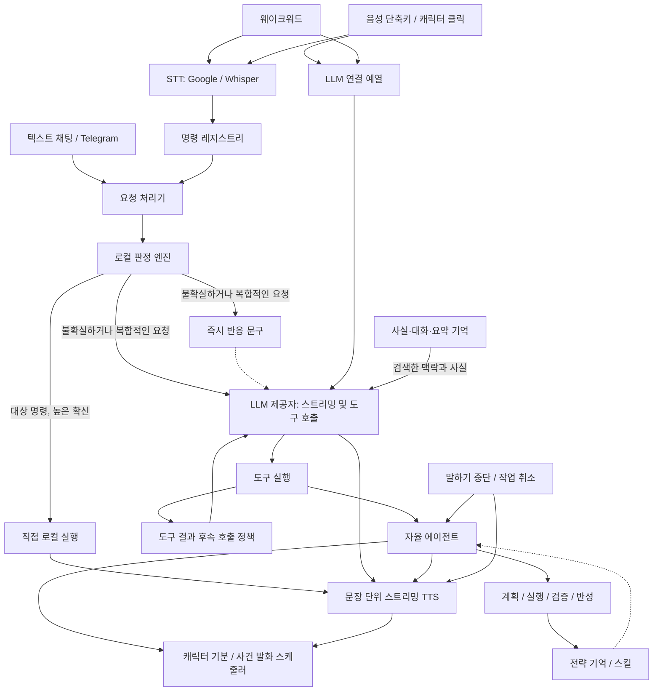

# 🎙️ Ari — 오픈소스 Windows 음성 비서 · 데스크톱 에이전트

<div align="center">
  
  <p><strong>말하거나 입력하거나 클릭해 Windows 작업을 맡기고, 음성으로 결과를 확인해 보세요.</strong></p>
  <p>
    
    
    
    
    
    <a href="https://app.codacy.com/gh/DO0OG/Ari-VoiceCommand/dashboard"></a>
  </p>
  <p><a href="./README.md">English</a> | <strong>한국어</strong> | <a href="./README.ja.md">日本語</a></p>
  <p>
    <a href="https://github.com/DO0OG/Ari-VoiceCommand/releases"></a>
    <a href="https://ari-voice-command.vercel.app"></a>
    <a href="./docs/USAGE.md"></a>
  </p>
</div>

---

## 왜 Ari인가요

- **음성과 작업 실행을 하나로:** 웨이크워드, 음성 단축키, 캐릭터 클릭으로 요청하고 여러 단계의 데스크톱 작업을 맡길 수 있습니다.
- **빠른 로컬 판정:** 확신이 높은 지원 명령은 LLM 없이 실행할 수 있고, 불확실한 요청은 설정된 제공자로 넘어갑니다. 직접 실행은 기본 꺼짐입니다.
- **반응하는 캐릭터:** 캐릭터가 활동과 기분을 표현하고, 돌아왔거나 작업을 마치는 등 특정 사건에 맞춰 말을 건넵니다.
- **로컬 또는 호스팅 모델 선택:** Ollama, 로컬 CosyVoice3와 ONNX 임베딩, OpenAI 호환 LLM 제공자를 사용할 수 있습니다. 원격 임베딩은 기본 꺼짐입니다.
- **직접 관리하는 기억:** 사실과 대화 기록을 검색하고 기억·잊기 명령을 사용할 수 있으며, 프로필 기억 후보를 검토한 뒤 저장할 수 있습니다.
- **확장과 다국어:** 플러그인, `SKILL.md` 스킬, MCP 도구를 추가할 수 있습니다. Telegram 원격 명령은 기본 꺼짐이며 한국어·영어·일본어를 지원합니다.

## 기능 한눈에 보기

| 영역 | Ari가 하는 일 |
| :--- | :--- |
| 음성 입력 | 웨이크워드, 음성 단축키, 캐릭터 클릭 · Google 또는 오프라인 Whisper STT |
| 텍스트·원격 입력 | 텍스트 채팅과 허용된 Telegram 명령 (Telegram 기본 꺼짐) |
| 로컬 판정 | 확신이 높은 명령을 위한 선택 기능입니다. 기본적으로 꺼져 있으며, 불확실한 요청은 LLM 대화 경로로 넘깁니다. |
| 자율 에이전트 | 작업을 계획하고 도구를 실행해 결과를 확인하며, 반성과 재사용 전략을 기록 |
| 기억 | 사실·대화 요약 검색, 기억하기·잊기, 기억 후보 검토 |
| 음성과 캐릭터 | 문장 단위 TTS 스트리밍, 기분 상태, 사건 기반 발화, 중단 제어 |
| 모델·확장 | Ollama, CosyVoice3, 로컬 ONNX 임베딩, OpenAI 호환 제공자, 플러그인, 스킬, MCP |

## 빠른 시작

### 요구 사항

- Windows 10/11 (64-bit).
- 소스 실행에는 Python 3.11이 필요합니다.
- RAM 8GB를 권장하며, 로컬 모델을 쓸 때는 GPU VRAM 4GB를 권장합니다.

### 설치

[Releases](https://github.com/DO0OG/Ari-VoiceCommand/releases)에서 `Ari-Setup-<version>.exe`를 내려받아 실행해 주세요. 기본 설치 위치는 `Program Files\Ari`이고, 설정과 기록은 `%AppData%\Ari`에 저장됩니다.

소스에서 실행할 때는 Python 3.11을 사용해 주세요.

```bat
git clone https://github.com/DO0OG/Ari-VoiceCommand.git
cd Ari-VoiceCommand\VoiceCommand
setup.bat
Ari.vbs
```

로컬 CosyVoice3는 `setup.bat --with-tts`로 준비할 수 있습니다. 이전 zip 배포판 데이터는 설정 → 장치 설정 → "이전 버전 데이터 가져오기"에서 `.ari_runtime` 폴더를 선택해 가져오세요. 진단용 `Ari.bat` 실행과 자세한 내용은 [사용 가이드](./docs/USAGE.md)를 참고해 주세요.

## 시스템 아키텍처

웨이크워드 입력이 연결 예열과 음성 인식을 시작하며, 텍스트와 Telegram 요청도 같은 요청 처리 경로로 들어옵니다.


```mermaid
graph TD
    Wake["웨이크워드"] --> STT["STT: Google / Whisper"]
    Manual["음성 단축키 / 캐릭터 클릭"] --> STT
    Manual --> Warm
    Wake --> Warm["LLM 연결 예열"]
    STT --> Registry["명령 레지스트리"]
    Chat["텍스트 채팅 / Telegram"] --> Handler["요청 처리기"]
    Registry --> Handler
    Handler --> Decision["로컬 판정 엔진"]
    Decision -- "대상 명령, 높은 확신" --> Fast["직접 로컬 실행"]
    Decision -- "불확실하거나 복합적인 요청" --> Ack["즉시 반응 문구"]
    Decision -- "불확실하거나 복합적인 요청" --> LLM["LLM 제공자: 스트리밍 및 도구 호출"]
    Ack -.-> LLM
    Warm --> LLM
    LLM --> Tools["도구 실행"]
    Tools --> Policy["도구 결과 후속 호출 정책"]
    Policy --> LLM
    Memory["사실·대화·요약 기억"] -- "검색한 맥락과 사실" --> LLM
    Tools --> Agent["자율 에이전트"]
    Agent --> Loop["계획 / 실행 / 검증 / 반성"]
    Loop --> Strategy["전략 기억 / 스킬"]
    Strategy -.-> Agent
    Fast --> TTS["문장 단위 스트리밍 TTS"]
    LLM --> TTS
    Agent --> TTS
    Agent --> Character["캐릭터 기분 / 사건 발화 스케줄러"]
    TTS --> Character
    Stop["말하기 중단 / 작업 취소"] --> TTS
    Stop --> Agent
```

- 로컬 판정 엔진은 지원 명령을 해석하고 신뢰도와 실행 정책을 통과했을 때만 처리합니다. 직접 실행은 기본 꺼짐입니다.
- 도구 결과에 따라 로컬에서 답하거나 LLM을 다시 호출합니다. 복합 작업은 계획·실행·검증·반성 흐름으로 이어질 수 있습니다.
- 검색한 사실과 대화 맥락을 제공자 프롬프트에 넣습니다. 문장 스트림은 TTS로 전달되며, 캐릭터는 기분과 사건별 발화를 표현합니다. 중단 제어는 음성과 작업을 멈춥니다.

## 판정 엔진 수치

- 생성한 테스트 문장 7,407개 중 파서 확인 선택 367건의 정밀도는 100.0%였고, 잘못 직접 실행한 경우는 0건입니다. 이 평가는 명령을 실행하거나 마이크 인식률을 측정하지 않습니다.
- AMD64 Windows 데스크톱에서 1,000회 실행한 웜 추론 지연은 p50 0.053ms, p95 0.100ms였습니다.

## v1.1 새 소식

- 즉시 반응 문구를 안내하고 웨이크워드를 감지하면 연결을 미리 준비합니다.
- 특정 사건에 맞춰 캐릭터가 말하고, 기억 후보를 검토해 관리할 수 있습니다.
- 응답을 스트리밍하고 문장 단위로 음성 출력합니다.

[전체 릴리스 보기](https://github.com/DO0OG/Ari-VoiceCommand/releases).

## 문서

- [사용 가이드](./docs/USAGE.md)
- [로컬 판정 엔진](./docs/LOCAL_DECISION_ENGINE.md)
- [자율 에이전트 고급 기능](./docs/AGENT_ADVANCED.md)
- [플러그인 가이드](./docs/PLUGIN_GUIDE.md) · [MCP 서버](./docs/MCP_SERVER.md)
- [테마 커스터마이징](./docs/THEME_CUSTOMIZATION.md)
- [인증 정보 보관](./docs/CREDENTIALS.md)

## 기여

기여를 환영합니다. 시작할 때는 [기여 가이드](./docs/CONTRIBUTING.md)를 확인해 주세요.

## 에셋 및 크레딧

- 기본 캐릭터 이미지 — **JAraTang** 작가님: <https://www.pixiv.net/users/78194943>
- `DNFBitBitv2` 폰트 — 공식 출처: <https://df.nexon.com/data/font/dnfbitbitv2>

프로젝트 밖으로 재배포하거나 다시 쓸 때는 해당 폰트의 이용 조건도 같이 확인해 주세요.

## License

Copyright © 2026 [DO0OG (MAD_DOGGO)](https://github.com/DO0OG).
This project is licensed under the **MIT License**.
