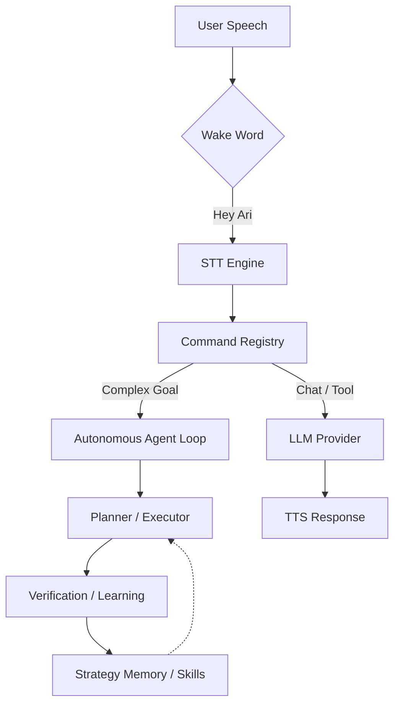

# 🎙️ Ari — Open-Source Windows AI Voice Assistant

<div align="center">
  
  <p align="center">
    <strong>A Windows voice assistant and desktop agent with wake word, multilingual STT/TTS, desktop automation, MCP tools, plugins, and local LLM support.</strong><br />
    Ari is an open-source Python/PySide6 desktop assistant for Windows. It listens, does the work, checks the result, and gets better at it over time.
  </p>

  <p align="center">
    
    
    
    
    
    
    
    
  </p>

  <p align="center">
    <a href="https://app.codacy.com/gh/DO0OG/Ari-VoiceCommand/dashboard">
      
    </a>
  </p>

  <p align="center">
    <a href="./README.ko.md">한국어</a> | <strong>English</strong> | <a href="./README.ja.md">日本語</a>
  </p>
</div>

---

## At a Glance

- **Windows-native voice assistant** with wake word activation, speech recognition, and spoken replies.
- **Autonomous agent loop** that plans desktop tasks, runs tools and code, and retries with self-correction when a step fails.
- **Local-first AI stack** built around Ollama and CosyVoice3, for setups that prefer to stay offline.
- **Room to extend:** plugins, `SKILL.md` skills, and Model Context Protocol (MCP) integration.
- **PySide6 desktop UI** with a character widget, chat interface, and visual verification.

### Quick Links

- [Usage Guide](./docs/USAGE.md)
- [Agent Skills / MCP](./docs/USAGE.md#4-에이전트-스킬-skills--mcp)
- [Plugin Development](./docs/PLUGIN_GUIDE.md)
- [Project Homepage](https://ari-voice-command.vercel.app)
- [Contributing](./docs/CONTRIBUTING.md)

---

## Quick Start

### Requirements

- **OS:** Windows 10/11 (64-bit)
- **Python:** 3.11
- **Hardware:** 8GB+ RAM recommended (4GB+ GPU VRAM recommended for local models)

### Installation & Run

```bat
git clone https://github.com/DO0OG/Ari-VoiceCommand.git
cd Ari-VoiceCommand
cd VoiceCommand
setup.bat
Ari.vbs
```

To install from the command line, run `py -3.11 install_dependencies.py`
instead of `setup.bat`.

Use `Ari.vbs` for normal launches; it starts Ari without showing a console
window. Run `Ari.bat` only for diagnostics when you need to see startup errors.
If a hidden launch fails, Ari shows the end of
`VoiceCommand/.ari_runtime/launcher_error.log` in a message box.

Plain `setup.bat` creates `.venv` for the main application and its usual
optional dependencies. To set up local CosyVoice3 as well, run
`setup.bat --with-tts`. That adds a second environment, `.venv-tts`, holding
CosyVoice3's CUDA-enabled torch and TTS packages. Keeping them in their own
venv is what stops them from overwriting the main application's CPU torch.

---

## What is Ari?

Ari is a **Windows AI voice assistant** and **autonomous desktop agent**. It listens to a request, works out how to carry it out, runs the work, checks the result, and reuses what it learned the next time around.

### Core Capabilities

| Area | What Ari Does |
| :--- | :--- |
| **Voice Pipeline** | Wake word activation, multilingual speech recognition (STT), and natural text-to-speech (TTS) replies. |
| **Agent & Automation** | Plans complex goals, writes Python/Shell automation, runs it, and retries with self-fixing strategies. |
| **Skills, Plugins & MCP** | Installable `SKILL.md` packages, plugin modules, and remote or local MCP tools. |
| **Local AI Stack** | Local LLM workflows through Ollama, plus local TTS pipelines for privacy-sensitive environments. |
| **UI & Verification** | A PySide6 desktop UI, animated character widget, text chat, and OCR-based result verification. |
| **Memory & Personalization** | Keeps user preferences and builds up reusable strategies for tasks that come around again. |
| **Remote Control** | Runs Ari commands from allow-listed Telegram chats through the same command pipeline as the local UI. |

### Character Widget Highlights

- **Night mode:** animation slows down late at night, and the character starts yawning and reacting sleepily.
- **Plugin extension points:** marketplace plugins can add tray actions, overlays, commands, and character reactions without shipping inside the core repository.

---

## Developer Highlights

- **Python + PySide6 desktop app:** easy to read through, extend, and package for Windows.
- **Automation-first design:** browser DOM control, file and system actions, and agent-driven workflows.
- **Open integration points:** OpenAI-compatible providers, Ollama, MCP servers, plugins, and installable skills.
- **A runtime that learns:** strategy memory, same-run reflection retries, embedding-based skill matching, and skill compilation all make repeated tasks go more smoothly.

### Recent Updates

- **Telegram remote command bridge:** allow-listed chat authorization, long-polling, streaming via message edits, and screenshot photo forwarding (`telegram_enabled`, disabled by default).
- **Restricted generated image downloads:** the image generation tool now only downloads images from HTTPS URLs.
- **Advanced autonomous agent features:** local MCP server (including file read/write tools), streaming/vision/file/app tools, interrupt & resume, audit logging, and an agent dashboard.
- **Multilingual command routing:** LLMRouter, WeatherCommand, and the tool handlers now recognize Korean, English, and Japanese keywords, so the agent activates correctly in every supported locale.
- **Configurable response cache:** LLM response cache TTL and maximum size can be set in `ari_settings.json` (`agent_response_cache_ttl`, `agent_response_cache_max_size`).
- **Async agent task queue:** `AgentTaskQueue` schedules background tasks by priority and can cancel them individually.
- **Full i18n for agent result messages:** execution status, agent run summaries, and report location strings are now translated properly in Korean, English, and Japanese.
- **safety_checker refinement:** `curl`/`wget` moved from DANGEROUS to CAUTION, so agents can make read-only HTTP requests. Data-sending flags stay DANGEROUS.
- **Fallback assistant i18n:** `SimpleAIAssistant` responses go through runtime translation, so the language stays correct even when Groq fails to initialize.
- **CommandResult propagation:** `WeatherCommand` and other commands return `CommandResult`, so plugin events see accurate success and failure information.
- **Immediate same-run recovery:** a failed run can feed its reflection lessons straight into a single retry inside the same orchestration session.
- **Background reflection path:** when a run succeeds, reflection can be scheduled asynchronously instead of holding up the completion the user is waiting on.
- **Shared-context caching:** the expensive Episode Memory and Goal Predictor lookups are collected once per run and reused across reflection retries.
- **Adaptive planning depth:** orchestration estimates how hard the goal is and adjusts the maximum number of replan iterations, instead of running a fixed loop count.
- **Lift-based activation gating:** learning metrics can temporarily switch off components whose measured lift has turned meaningfully negative.
- **Consistent i18n maintenance:** new strings land in the Korean, English, and Japanese locale files together.

---

## System Architecture

A wake word starts everything. From there a request passes through the command and agent layers, runs as a tool call or an LLM workflow, and finally gets verified and folded back into what Ari has learned.



---

## Performance & Learning

Ari is built to get better the more you use it.

| Task Category | Initial Success | Post-Learning |
| :--- | :---: | :---: |
| **File/System Control** | 85% | **98%** |
| **Web Browsing/Search** | 65% | **88%** |
| **Complex Workflow** | 40% | **75%** |

- **Step 1 (0-50 runs):** exploring, and building up `StrategyMemory`
- **Step 2 (50-200 runs):** optimization and skill compilation
- **Step 3 (200+ runs):** routine work runs faster and leans on the LLM less

---

## Documentation

- **[Usage Guide](./docs/USAGE.md)**: setup, operation, and configuration
- **[Agent Skills / MCP](./docs/USAGE.md#4-에이전트-스킬-skills--mcp)**: skill installation, management UI, and MCP flows
- **[Plugin Development](./docs/PLUGIN_GUIDE.md)**: extending Ari with your own features
- **[Theme Customization](./docs/THEME_CUSTOMIZATION.md)**: UI and appearance changes

---

## Contributing

Contributions are welcome, particularly around Windows automation, STT/TTS integrations, local model support, PySide6 UX, plugin tooling, and MCP workflows.

The [contribution guide](./docs/CONTRIBUTING.md) is the place to start.

---

## Assets & Credits

- `DNFBitBitv2` font — official source:
  <https://df.nexon.com/data/font/dnfbitbitv2>

Check the font's usage terms before redistributing or reusing it outside this project.

---

## License

Copyright © 2026 [DO0OG (MAD_DOGGO)](https://github.com/DO0OG).
This project is licensed under the **MIT License**.
