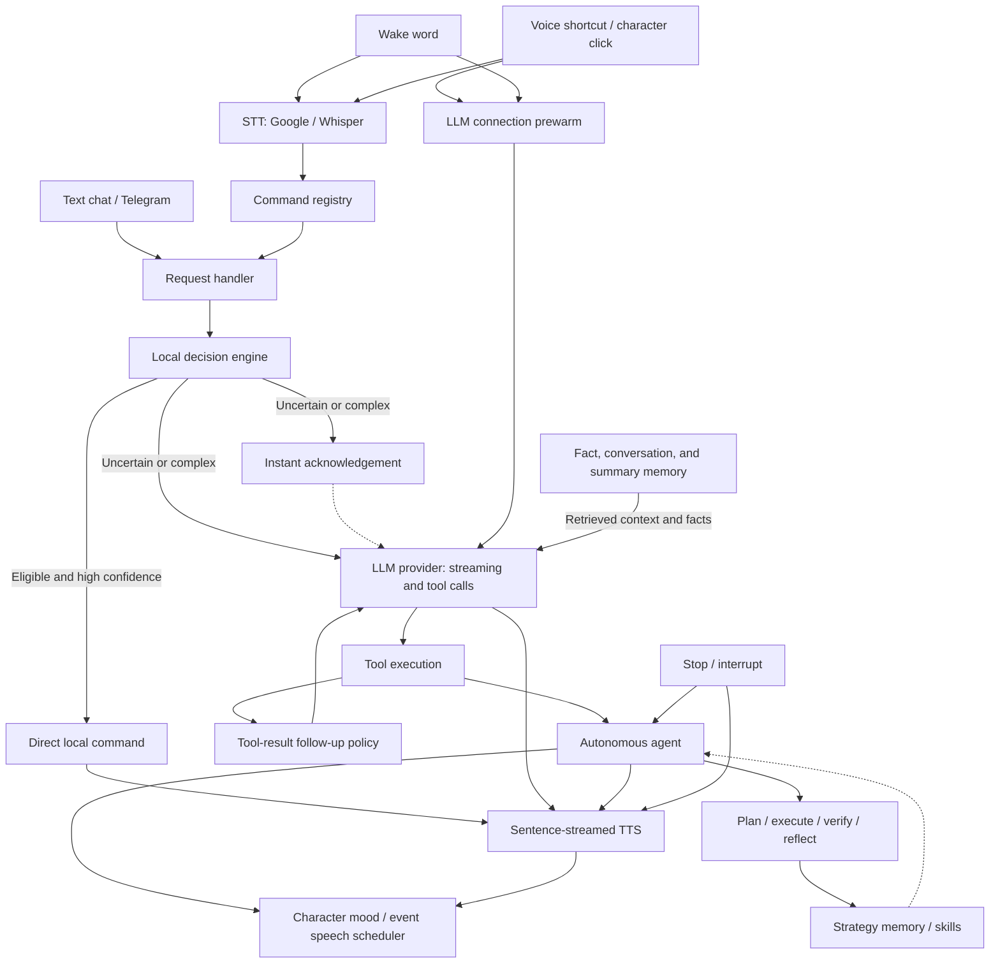

# 🎙️ Ari — Open-Source Windows Voice Assistant & Desktop Agent

<div align="center">
  
  <p><strong>Speak, type, or click to ask Ari to carry out Windows tasks and report back in voice.</strong></p>
  <p>
    
    
    
    
    
    <a href="https://app.codacy.com/gh/DO0OG/Ari-VoiceCommand/dashboard"></a>
  </p>
  <p><strong>English</strong> | <a href="./README.ko.md">한국어</a> | <a href="./README.ja.md">日本語</a></p>
  <p>
    <a href="https://github.com/DO0OG/Ari-VoiceCommand/releases"></a>
    <a href="https://ari-voice-command.vercel.app"></a>
    <a href="./docs/USAGE.md"></a>
  </p>
</div>

---

## Why Ari

- **Voice and agency together:** Wake Ari by voice, shortcut, or character click, then hand off multi-step desktop work.
- **Fast local decisions:** Eligible, high-confidence commands can run without an LLM; uncertain requests use the configured provider. Direct execution is off by default.
- **A character that responds:** The widget reflects activity and mood, with event-based speech for moments such as returning or finishing a task.
- **Local or hosted models:** Use Ollama, local CosyVoice3 and ONNX embeddings, or OpenAI-compatible LLM providers. Remote embeddings are off by default.
- **Memory you can manage:** Search facts and conversation history, ask Ari to remember or forget, and review suggested profile facts before accepting them.
- **Room to extend:** Add plugins, `SKILL.md` skills, or MCP tools; optional Telegram remote commands are off by default. Ari supports Korean, English, and Japanese.

## Features at a glance

| Area | What Ari does |
| :--- | :--- |
| Voice input | Wake word, voice shortcut, or character click; Google or offline Whisper STT |
| Text and remote input | Text chat and allow-listed Telegram commands (Telegram is off by default) |
| Local decision | Optional high-confidence command path; off by default, with LLM fallback |
| Autonomous agent | Plans, executes tools, verifies results, and records reflections and reusable strategies |
| Memory | Retrieves facts and conversation summaries; supports search, remember, forget, and review |
| Speech and character | Sentence-streamed TTS, mood state, event-based speech, and stop controls |
| Models and extensions | Ollama, CosyVoice3, local ONNX embeddings, OpenAI-compatible providers, plugins, skills, and MCP |

## Quick start

### Requirements

- Windows 10/11 (64-bit).
- Python 3.11 for source installs.
- 8 GB RAM recommended; 4 GB GPU VRAM recommended for local models.

### Install

Download `Ari-Setup-<version>.exe` from [Releases](https://github.com/DO0OG/Ari-VoiceCommand/releases). It installs to `Program Files\Ari` by default; settings and history are stored in `%AppData%\Ari`.

To run from source, use Python 3.11:

```bat
git clone https://github.com/DO0OG/Ari-VoiceCommand.git
cd Ari-VoiceCommand\VoiceCommand
setup.bat
Ari.vbs
```

For local CosyVoice3, run `setup.bat --with-tts`. To import data from an older zip release, use Settings → Device Settings → “Import data from previous version” and select its `.ari_runtime` folder. Use `Ari.bat` for diagnostics; see the [Usage Guide](./docs/USAGE.md).

## System architecture

Wake-word input starts connection prewarming and speech recognition; text and Telegram reach the same interaction handler.


```mermaid
graph TD
    Wake["Wake word"] --> STT["STT: Google / Whisper"]
    Manual["Voice shortcut / character click"] --> STT
    Manual --> Warm
    Wake --> Warm["LLM connection prewarm"]
    STT --> Registry["Command registry"]
    Chat["Text chat / Telegram"] --> Handler["Request handler"]
    Registry --> Handler
    Handler --> Decision["Local decision engine"]
    Decision -- "Eligible and high confidence" --> Fast["Direct local command"]
    Decision -- "Uncertain or complex" --> Ack["Instant acknowledgement"]
    Decision -- "Uncertain or complex" --> LLM["LLM provider: streaming and tool calls"]
    Ack -.-> LLM
    Warm --> LLM
    LLM --> Tools["Tool execution"]
    Tools --> Policy["Tool-result follow-up policy"]
    Policy --> LLM
    Memory["Fact, conversation, and summary memory"] -- "Retrieved context and facts" --> LLM
    Tools --> Agent["Autonomous agent"]
    Agent --> Loop["Plan / execute / verify / reflect"]
    Loop --> Strategy["Strategy memory / skills"]
    Strategy -.-> Agent
    Fast --> TTS["Sentence-streamed TTS"]
    LLM --> TTS
    Agent --> TTS
    Agent --> Character["Character mood / event speech scheduler"]
    TTS --> Character
    Stop["Stop / interrupt"] --> TTS
    Stop --> Agent
```

- The local decision engine only executes supported, well-parsed commands that pass its confidence and policy checks; direct execution defaults to off.
- Tool results follow a configurable policy for a local reply or an LLM follow-up. Complex tasks can enter the plan, execution, verification, and reflection loop.
- Retrieved facts and conversation context are added to provider prompts. Streamed sentences go to TTS; the character reflects mood and scheduled events, and stop controls interrupt active output or agent work.

## Decision engine numbers

- Held-out generated text evaluation: 367 parser-confirmed selections, 100.0% measured precision, and 0 false direct selections among 7,407 examples. The evaluator does not execute commands or measure microphone recognition.
- Warm inference: p50 0.053 ms and p95 0.100 ms over 1,000 iterations on an AMD64 Windows desktop.

## What's new in v1.1

- Instant acknowledgements and wake-time connection prewarming.
- Event-based character speech and reviewable memory management.
- Streaming responses with sentence-level speech output.

[See all releases](https://github.com/DO0OG/Ari-VoiceCommand/releases).

## Documentation

- [Usage guide](./docs/USAGE.md)
- [Local decision engine](./docs/LOCAL_DECISION_ENGINE.md)
- [Advanced agent guide](./docs/AGENT_ADVANCED.md)
- [Plugin guide](./docs/PLUGIN_GUIDE.md) · [MCP server](./docs/MCP_SERVER.md)
- [Theme customization](./docs/THEME_CUSTOMIZATION.md)
- [Credentials](./docs/CREDENTIALS.md)

## Contributing

Contributions are welcome. Start with the [contribution guide](./docs/CONTRIBUTING.md).

## Assets & credits

- Default character illustrations by **JAraTang**: <https://www.pixiv.net/users/78194943>
- `DNFBitBitv2` font, official source: <https://df.nexon.com/data/font/dnfbitbitv2>

Check the font's usage terms before redistributing or reusing it outside this project.

## License

Copyright © 2026 [DO0OG (MAD_DOGGO)](https://github.com/DO0OG).
This project is licensed under the **MIT License**.
